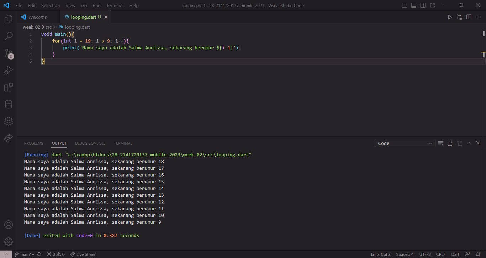
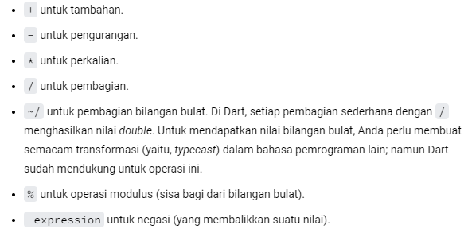
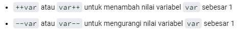
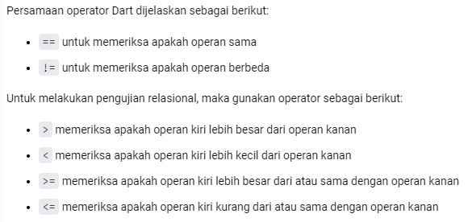
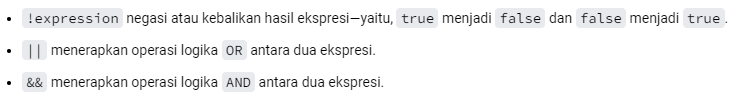

Project Minggu Ke-2

NIM : 2141720137

Nama : Salma Annissa Azizi

SOAL 1

Tampilan Screenshoot

SOAL 2

Pertanyaan : Mengapa sangat penting untuk memahami bahasa pemrograman Dart sebelum kita menggunakan framework Flutter ? Jelaskan!

Jawab : Flutter adalah sebuah framework pembuatan aplikasi mobile yang dapat digunakan dengan menggunakan bahasa pemrograman Dart, C, dan C++. Sehingga untuk memanfaatkan Flutter, maka kita harus mempelajari bahasa pemrograman Dart terlebih dahulu agar dapat membangun sebuah aplikasi. Memiliki pemahaman dasar yang kuat tentang Dart akan memudahkan produktivitas dalam pengembangan aplikasi pada Flutter.

SOAL 3

Pertanyaan : Rangkumlah materi dari codelab ini menjadi poin-poin penting yang dapat Anda gunakan untuk membantu proses pengembangan aplikasi mobile menggunakan framework Flutter.

Jawab : Dart merupakan bahasa pemrograman tingkat tinggi yang diciptakan untuk menggabungkan kelebihan dari sebagian besar bahasa pemrograman terkini. Dart memiliki fitur untuk menganalisis kode serta package yang besar. Dart juga dapat mengelola dealokasi memori yang ditempati oleh objek yang tidak lagi digunakan. Portability bahasa pemrograman Dart juga tidak hanya untuk web melainkan juga dapat dikompilasi ke kode ARM dan x86.

Dalam penggunaan bahasa pemrograman Dart, untuk melakukan operasi hitung dapat menggunakan operator seperti berikut :

Sedangkan untuk melakukan penambahan dan pengurangan nilai menggunakan increment dan decrement maka dapat memanfaatkan kode program seperti berikut :

Dalam menentukan nilai pengujian dalam hubungan antara dua variabel maka dapat menggunakan kode program seperti berikut :

Sedangkan untuk menghasilkan nilai BOOLEAN dalam Dart maka dapat digunakan kode program seperti berikut :
