Project Minggu Ke-3

NIM : 2141720137

Nama : Salma Annissa Azizi

# PRAKTIKUM 1

## Langkah 2
Saat melakukan eksekusi langkah 1 terdapat error pada kode program tersebut. Hal ini dikarenakan pada sintaks yang dituliskan pada text editor bukan merupakan sintaks If-Else if-Else melainkan If-Else dan If-Else yang menyebabkan error.

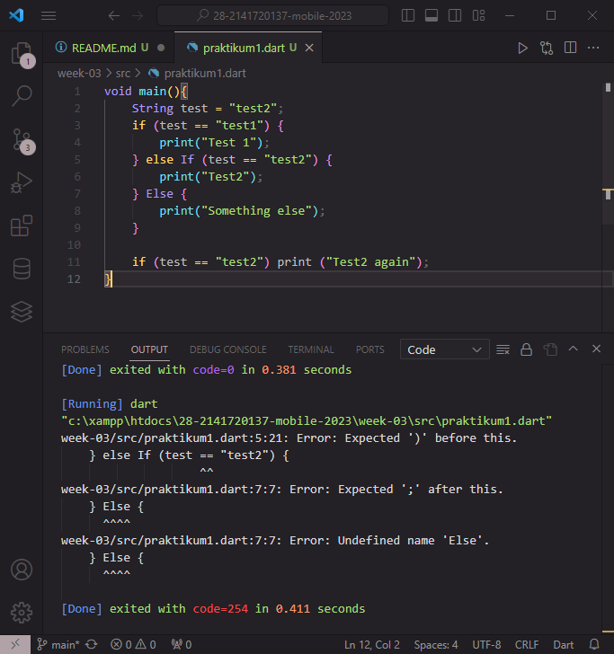

## Langkah 3
Saat menambahkan kode program dalam langkah 3 masih terjadi error dan kini disebabkan pendeklarasian dua variabel dengan nama yang sama dan mengisikan variabel bertipe String menggunakan nilai boolean. Hal tersebut menyebabkan error pada kode program.

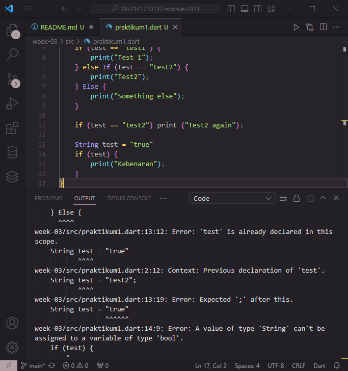

### Perbaikan Error pada Kode Program
Perbaikan yang dilakukan untuk menangani error yang disebabkan kode program di atas adalah dengan mengganti struktur yang semula If-Else dan If-Else menjadi If-Else if-Else. Serta merubah tipe data pada praktikum 1 langkah ketiga menjadi *bool* dan merubah nama variabel menjadi test2. Selain itu pada penulisan nilai variabel *bool* dilakukan tanpa tanda petik. Sehingga kode program akan menghasilkan output sebagai berikut :

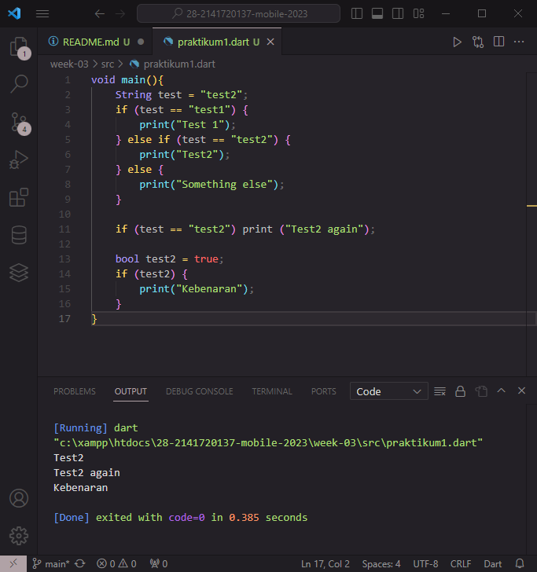

# PRAKTIKUM 2

## Langkah 2
Error terjadi saat melakukan run code dikarenakan variabel counter belum dideklarasi dan diinisiasi, sehingga program tidak mengenali variabel tersebut.

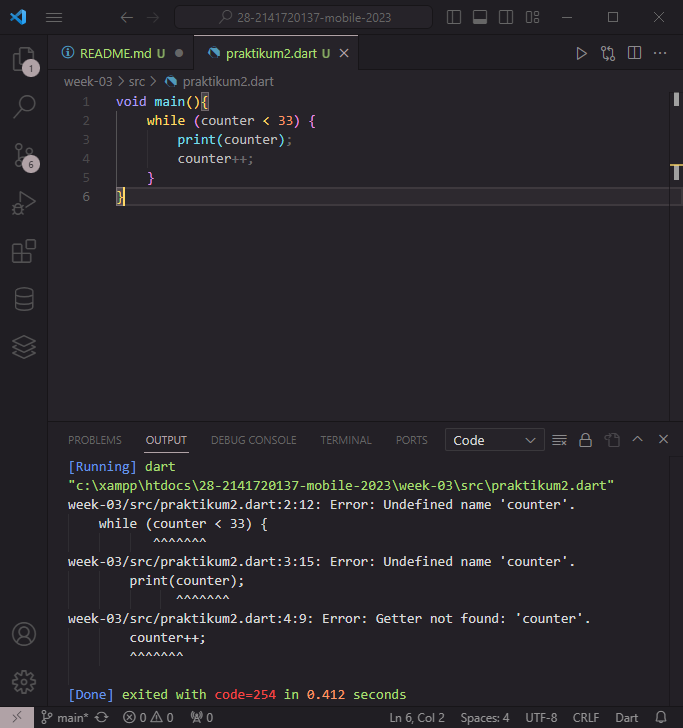

### Perbaikan kode program :
Mendeklarasi serta menginisiasi variabel counter sehingga dapat dikenali oleh program dan dieksekusi untuk melakukan perulangan dalam kondisi tertentu.

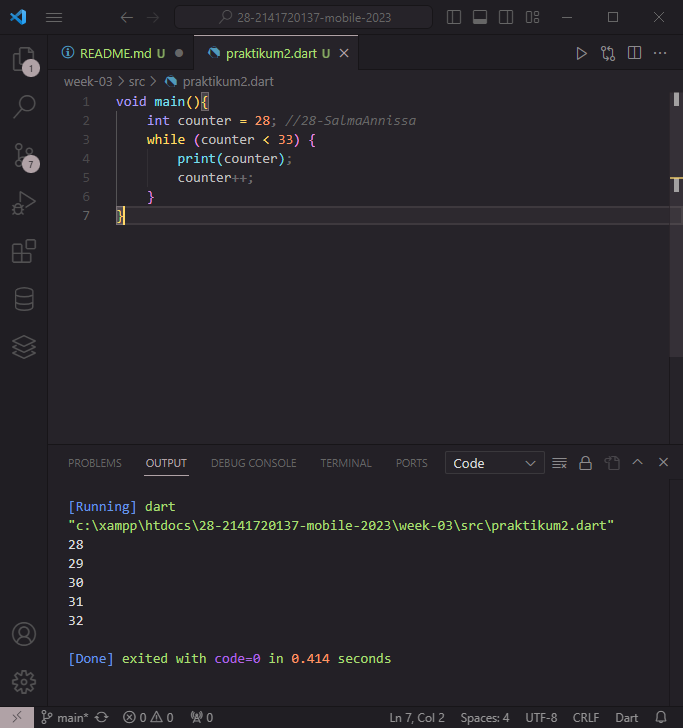

## Langkah 3
Pada penambahan kode program di langkah ketiga maka program akan mencetak nilai counter sampai dengan 76. Hal ini dikarenakan pada perulangan do-while, program akan mengeksekusi pernyataan terlebih dahulu dan mengecek kondisi di akhir perulangan. Sehingga nilai counter akan terus bertambah terlebih dahulu dan mencetak nilai 76 sebagai hasil looping akhir karena pada saat terjadi increment, counter sudah bernilai 77 dan tidak lagi memenuhi persyaratan di akhir perulangan. Perulangan pun berhenti.

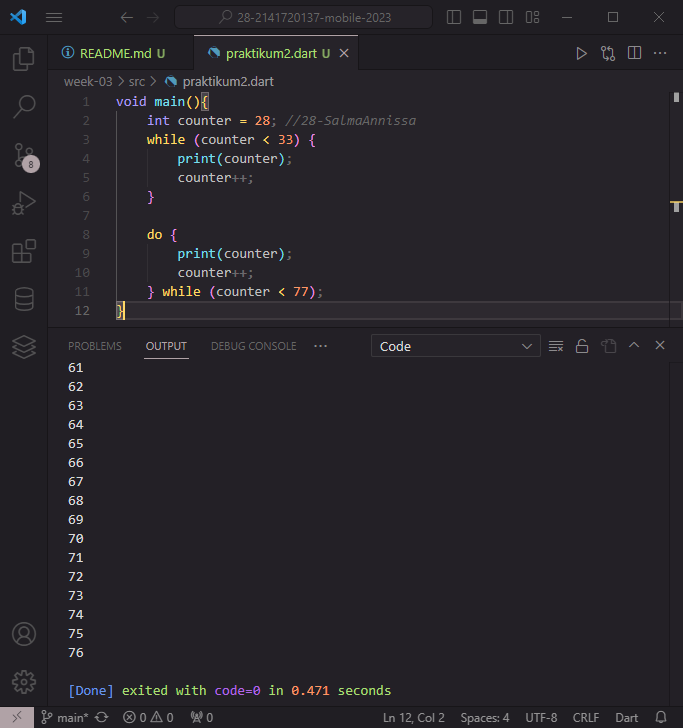

# PRAKTIKUM 3

## Langkah 2
Pada saat melakukan eksekusi terjadi error pada kode program. Hal ini dikarenakan variabel index belum dideklarasi serta diinisiasi. Pada perulangan tersebut juga belum memiliki perubahan nilai variabel yang menyebabkan infinite loop.

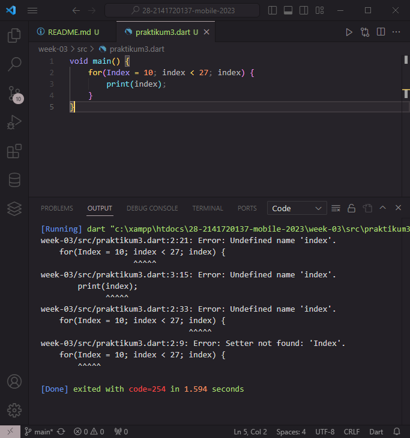

### Perbaikan kode program : 
Melakukan deklarasi pada variabel index dengan nilai tipe int. Dan memberikan operator increment pada index supaya tidak terjadi infinite loop.

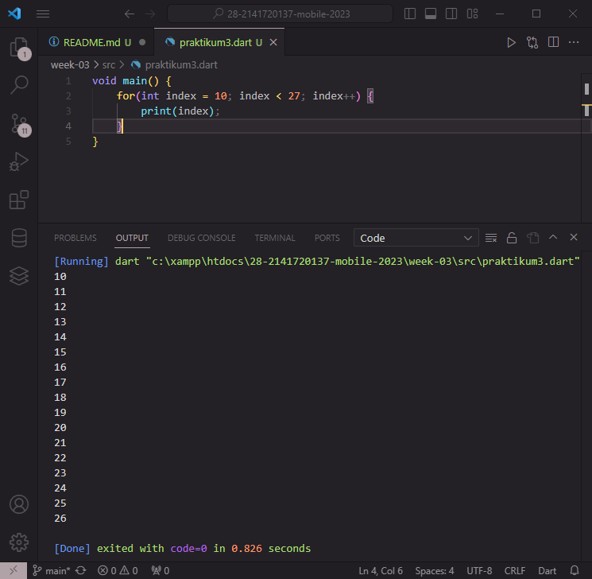

## Langkah 3
Pada langkah ini terjadi error dikarenakan sintaks yang digunakan tidak sesuai.

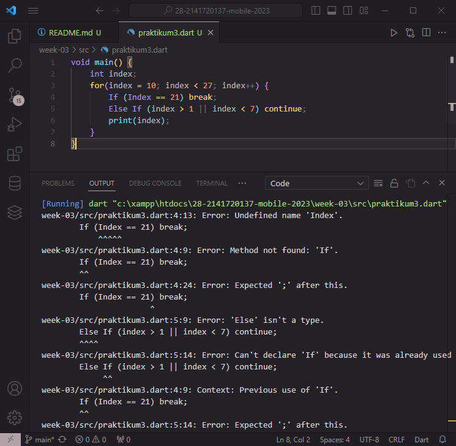

### Perbaikan Langkah 3
Melakukan perbaikan sintaks dan output dari kode program berikut ialah tidak mencetak apapun karena nilai index selalu memenuhi kondisi untuk di CONTINUE dan BREAK. Tanpa melalui eksekusi print.

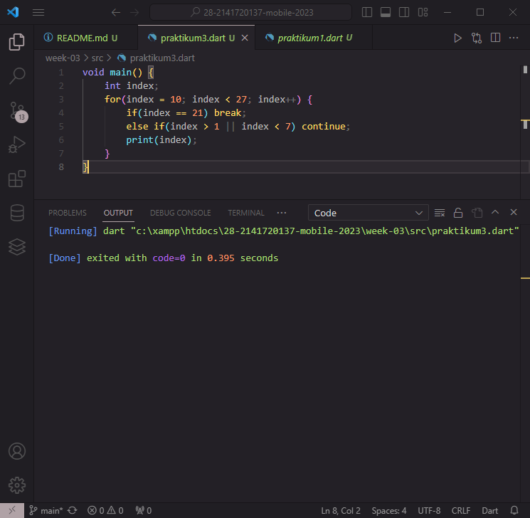

# TUGAS PRAKTIKUM

### Buatlah sebuah program yang dapat menampilkan bilangan prima dari angka 0 sampai 201 menggunakan Dart. Ketika bilangan prima ditemukan, maka tampilkan nama lengkap dan NIM Anda.

Kode Program :

Hasil :

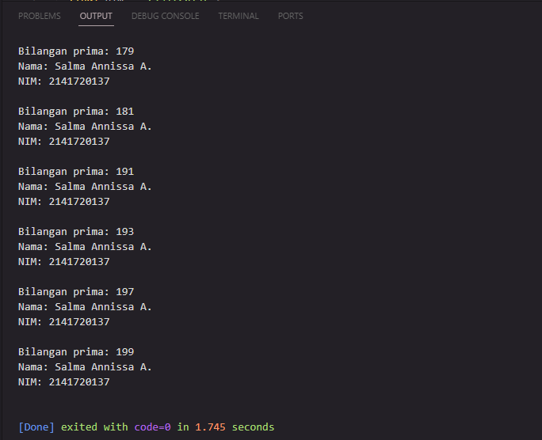

### Mencoba kode program menggunakan Switch-Case
Switch-Case pada dart memungkinkan berhenti tanpa break apabila dalam satu case terdapat sintaks print. Perbedaan ini terlihat pada bahasa pemrograman Java dan Dart karena pada Java apabila suatu case bernilai TRUE tidak memiliki break maka akan mencetak default. Sedangkan Dart akan mencetak case yang dianggap benar sampai menemukan print atau BREAK.

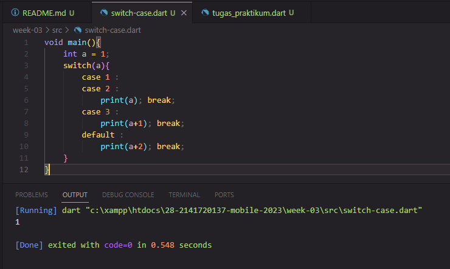
