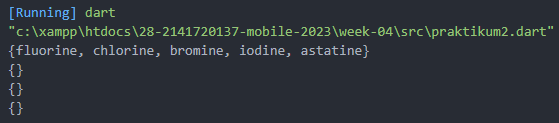
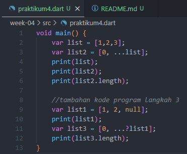
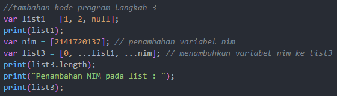
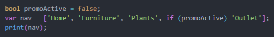
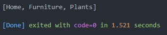
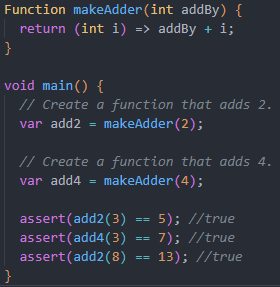

#### **28. Salma Annissa Azizi (2141720137) / TI - 3F**

# **JOBSHEET 4**

## **PRAKTIKUM 1**

**Langkah 1**  

**Langkah 2** 

Pertama, program akan mencetak angka 3 yang berasal dari list.length = 3. Kedua, program akan mencetak angka 2 yang berasal dari nilai list berindeks 1 sebesar 2. Ketiga, program mencetak list[1] yang sebelumnya telah dirubah. Semula nilainya adalah 2, namun setelah dirubah nilainya menjadi 1. Sehingga program mencetak 3, 2, 1 secara berurutan.

**Langkah 3**
- Kode Program  

- Hasil Run  

## **PRAKTIKUM 2**

**Langkah 1**  

**Langkah 2** 

Kode program yang dibuat pada langkah 1 akan menghasilkan sebuah print out lima nilai yang terdapat pada set bernama halogens yaitu fluorine, chlorinem bromine, iodine, dan astatine.

**Langkah 3** 
- Pada langkah 3, jika kode program yang tertera pada jobsheet ditambahkan maka tidak akan muncul error. Hasil kode program akan tampil sebagai berikut :  

- Modifikasi kode program dengan menambahkan elemen nama dan NIM pada kedua variabel Set dengan dua fungsi berbeda dan menghapus variabel maps :  

- Hasil run modifikasi program :  

## **PRAKTIKUM 3**

**Langkah 1**  

**Langkah 2**  

Kode program yang dibuat pada langkah 1 akan menghasilkan sebuah print out setiap key dan value yang dimiliki dua maps tersebut. Pada maps untuk setiap key dan value mendukung semua jenis tipe data termasuk sebuah obyek.

**Langkah 3**  
- Menambahkan kode program berikut : 

- Hasil Run :  

- Hasil run dari menambahkan kode program berikut adalah value dari key fifth di Gifts berubah menjadi golden rings sedangkan value dari key 18 di nobleGases menjadi argon.
- Modifikasi kode program untuk menampilkan nama dan NIM pada tiap variabel di atas :  

- Hasil Run :  

## **PRAKTIKUM 4**

**Langkah 1** 

**Langkah 2** 
  
Kode program pada langkah satu menghasilkan print out elemen yang berada variabel list (1,2,3). Lalu program kembali mencetak varibel list2 yang merupakan gabungan antara elemen list2 (0) itu sendiri dan list (1, 2, 3) sehingga print out nya dalah (0,1,2,3). Baris terakhir mencetak panjang list2 yaitu 4.

**Langkah 3**  
- Kode Program :  

- Hasil Run :  
   **Penjelasan** : Pada langkah ini terdapat peringatan bahwa List memiliki operasi null-aware yang tidak termasuk null. Sehingga apabila *question mark* dihilangkan tidak akan terjadi error.

- *Modifikasi kode program tanpa menggunakan question mark :*  

- *Hasil run tanpa menggunakan question mark :* 

- *Modifikasi menambahkan nim menggunakan spread operators*  

- *Hasil Run*  

**Langkah 4**

- Kode Program  

  Saat kode program dijalankan akan terjadi error dikarenakan variabel promoActive belum dideklarasi & diinisiasi.

- promoActive TRUE  
      
    Hasil Run : *Karena kondisi TRUE maka Outlet dicetak.*  
    

- promoActive FALSE  
      
    Hasil Run : *Karena kondisi FALSE maka Outlet tidak dicetak.*  
    

**Langkah 5**
- Kode Program :  

- Hasil Run :   

- Perbaikan Kode Program :  

- Hasil Run :  
   
Ketika login tidak bernilai manager maka inventory tidak akan dicetak.

- Kode Program :  
    
- Hasil :  
    

**Langkah 6**

- Kode Program  

- Hasil Run  

  Penjelasan : Collection for dilakukan untuk melakukan perulangan seperti pada bahasa pemrograman Python. Apabila nilai i bernilai seperti pada listOfInts maka akan melakukan pencetakan nilai i.

## **PRAKTIKUM 5**

**Langkah 1**

- Kode Program :  

**Langkah 2**

- Hasil Run :  
  
Penjelasan : Pada langkah ini pembuatan variabel record bertipe records dengan elemen string dan maps.

**Langkah 3**  

- Modifikasi supaya kode program dipanggil dalam main :  

- Hasil Run :  

**Langkah 4**

- Kode Program :  

- Hasil Run :  
  
Error dikarenakan variabel mahasiswa belum diinisialisasi dan tidak seharusnya bernilai null.

- Modifikasi variabel record mahasiswa dengan nama dan NIM :
    -   Kode Program  
    modifrun54
    - Hasil Run  
    

**Langkah 5**
- Kode Program :  

- Hasil Run :  

- Sintaks print baris pertama mencetak first karena mengakses field berindeks 1 yang berisi first.
- Sintaks print baris kedua mencetak 2 karena mengakses field dengan key a yang memilki nilai 2.
- Sintaks print baris ketiga mencetak true karena mengakses field dengan key b yang memilki nilai true.
- Sintaks print baris keempat mencetak last karena mengakses field dengan indeks 2 yaitu last dengan mengabaikan elemen yang memiliki key&value (maps)
- Modifikasi kode program dengan mengubah salah satu isi records menjadi nama dan nim :  

- Hasil Run :  

## **Tugas Praktikum**

1. Dokumentasi sudah dilakukan pada laporan di atas.
2. Functions dalam bahasa pemrograman Dart adalah sebuah fungsi yang dibangun dari kode program yang dapat dipanggil dan digunakan secara berulang. Fungsi dapat dimanfaatkan untuk menyimpan sebuah algoritma tertentu yang nantinya akan dipakai secara berulang untuk mempersingkat kode program. Functions dideklarasikan menggunakan nama, tipe pengembalian, dan sebuah parameter.
3. Jenis-jenis parameter Functions pada Dart :
    - Named parameters  
        Named parameters adalah jenis parameter yang nama parameternya harus spesifik. Sehingga ketika fungsi itu digunakan maka namanya harus sama dengan named parameter yang telah diatur. 
        Contoh :  
        - Kode Program  
        
        - Hasil Run  
        
    - Optional positional parameters  
        Optional parameter adalah jenis parameter yang dapat digunakan secara opsional. Yang dimaksud opsional di sini adalah apabila parameter tersebut didekelarasi, namun tidak digunakan maka tidak akan menimbulkan error.  
        Contoh :
        - Kode Program  
        
        - Hasil Run  
        
4. Yang dimaksud Functions sebagai first-class objects adalah fitur functions yang dapat digunakan sebagai parameter atas function lain.  
Contoh :
    - Kode Program  
    
    - Hasil Run  
    
5. Anonymous functions adalah sebuah fungsi yang tidak memiliki nama / nameless. Functions ini kadang juga disebut sebagai lambda atau closure. Functions ini biasanya berupa variabel yang dapat digunakan untuk menambah atau menghapusnya dari collections.  
Contoh :
    - Kode Program  
    
    - Hasil Run  
    

6. Lexical Scope adalah ketika sebuah variabel dapat digunakan dalam jangkauan yang luas. Dicontohkan variabel yang dideklarasikan pada level global maka dapat digunakan dalam fungsi manapun. Contohnya sebagai berikut :  
    - Kode Program  
    
    - Hasil Run  
      

    Lexical Closure adalah ketika sebuah variabel yang dideklarasikan pada sebuah function di luar main maka dapat digunakan pada main tanpa harus memanggil fungsi tersebut. Hal ini disebabkan karena di manapun function tersebut dikembalikan, fungsi tersebut akan selalu mengingat variabel yang dideklarasikan. Contoh :  
    - Kode Program  
    

7. Contoh kode program :  
 
Penjelasan : Pertama dilakukan deklarasi sebuah function bernama **multipleVal** dengan tipe pengembalian value yang bersifat multiple. Arti multiple di sini adalah fungsi dapat melakukan pengembalian value dengan beberapa jenis tipe data. Pada contoh yang saya berikan, function yang dibuat akan mengembalikan tiga tipe data yaitu String, int, dan boolean.   
Maka saat function tersebut dipanggil di dalam main pada variabel result dan dilakukan print out, program akan mencetak nilai dari variabel result yang menyimpan nilai kembalian function **multipleVal** seperti berikut :  

