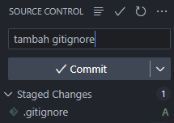
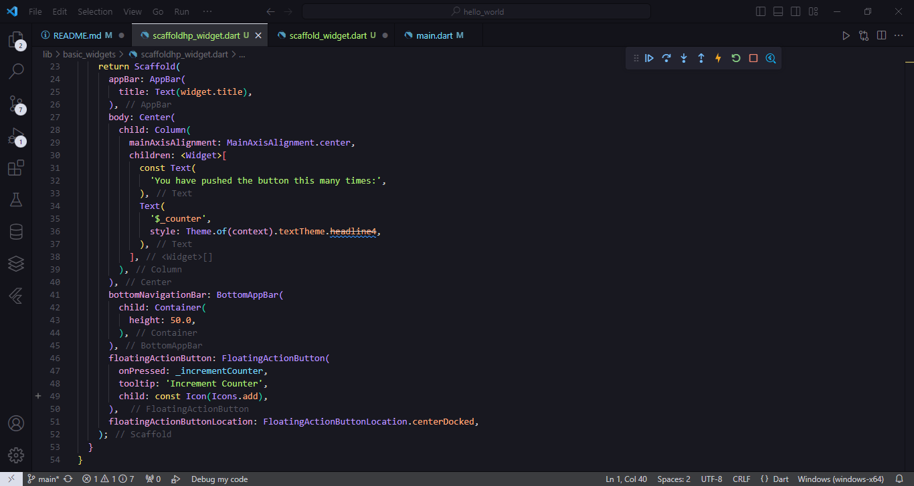
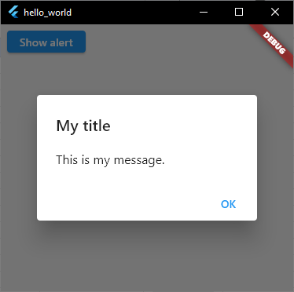

# **28. Salma Annissa Azizi (2141720137) / TI - 3F**

## **<b>PRAKTIKUM 1 </b>**

### **Langkah 1 :**
- Membuat application project dengan command flutter pada VSCode  

### **Langkah 2 :**
- Memilih direktori yang akan digunakan untuk menyimpan project  

### **Langkah 3 :**
- Memberikan nama pada project yang akan dibuat  

### **Langkah 4 :**
- Tampilan awal project yang berhasil dibuat adalah sebagai berikut :  

## **<b>PRAKTIKUM 2 </b>**

### **Langkah 1 :**
- Membuat repository baru dengan nama yang sudah ditentukan sebagai berikut  

### **Langkah 2 :**
- Menampilkan repository yang berhasil dibuat 

### **Langkah 3 :**
- Melakukan git init untuk menghubungkan folder lokal dengan github 

### **Langkah 4 :**
- Melakukan stages pada file .gitignore 

### **Langkah 5 :**
- Menambahkan pesan commit lalu melakukan commit 

### **Langkah 6 :**
- Melakukan push  

### **Langkah 7 :**
- Menambahkan remote pada folder  

### **Langkah 8 :**
- Memilih repository mana yang akan digunakan untuk penyimpanan project 

- Menambahkan remote name dengan nama origin  

### **Langkah 9 :**
- Melakukan commit and push pada file README.md 

### **Langkah 10 :**
- Melakukan commit and push untuk semua file yang telah dibuat pada project hello_world 

### **Langkah 11 :**
- Menampilkan emulator pada VSCode 

### **Langkah 12 :**
- Memodifikasi README.md sehingga akan tampil sebagai berikut :  

## **<b>PRAKTIKUM 3 </b>**

### **Langkah 1 : Text Widget**
- Kode Program Text Widget 

- Hasil Run Emulator untuk Text Widget 

### **Langkah 2 : Image Widget**
- Kode Program Image Widget 

- Melakukan penyesuaian assets sebelum gambar ditampilkan 

- Hasil Run Emulator untuk Image Widget 

## **<b>PRAKTIKUM 4 </b>**

### **Langkah 1 : Cupertino Button dan Loading Bar**
- Kode Program Cupertino Button dan Loading Bar pada file **loading_cupertino.dart** 

- Modifikasi file **main.dart** dengan kode program berikut :  

- Hasil Run Kode Program  

### **Langkah 2 : Floating Action Button**
- Kode Program Floating Action Button pada file **fab_widget.dart** 

- Melakukan modifikasi pada main.dart 

- Hasil Run Kode Program 

### **Langkah 3 : Scaffold Widget**
- Kode Program Scaffold Widget : 

- Hasil Run :  

### **Langkah 4 : Dialog Widget**
- Kode Program Dialog Widget 

- Hasil Run Kode Program :  
  
Program akan tampil seperti berikut jika widget diklik :  
 

### **Langkah 5 : Input and Selection Widget**
- Kode Program Input and Selection Widget 

- Hasil Run  

### **Langkah 6 : Date and Time Pickers**
- Kode Program Date and Time Pickers 

- Hasil Run  

## **<b> Tugas Praktikum </b>**

1. Praktikum sudah dilakukan di langkah-langkah sebelumnya.
2. Melakukan langkah-langkah praktikum 4 langkah 3-6 pada folder basic_widgets  
    - **Scaffold Widget**  
        - Kode Program  
            - main.dart  
            
            - scaffold_widget.dart  
            
            - scaffoldhp_widget.dart  
            
            
        - Hasil Run  
            
    - **Dialog Widget**  
        - Kode Program  
            - main.dart  
            
            - dialog_widget.dart  
            
            - dialogLayout_widget.dart  
            
            
        - Hasil Run akan memunculkan pop up sebagai berikut jika tombol dipencet 
            
    - **Input dan Selection Widget**
        - Kode Program  
            - main.dart  
            
            - input_selection.dart  
            
        - Hasil Run  
            
    - **Data and Time Pickers**  
        - Kode Program  
            - main.dart  
                                    
            - date_time_widget.dart  
                        
            - date_time_hp.dart  
            
            
        - Hasil Run  
        
        
3. Menyelesaikan Codelabs: Your first Flutter app  
    - Menambahkan tombol  
    
    - Menambahkan kartu  
    

