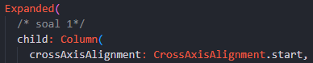
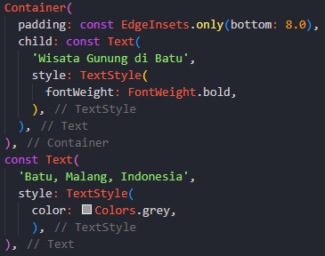
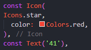
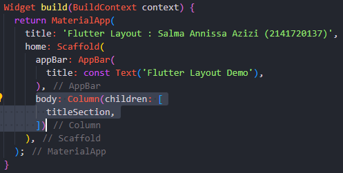
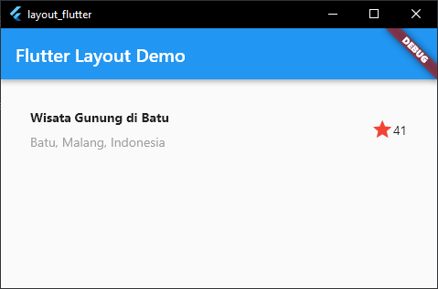
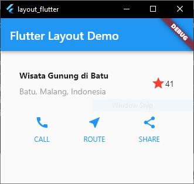
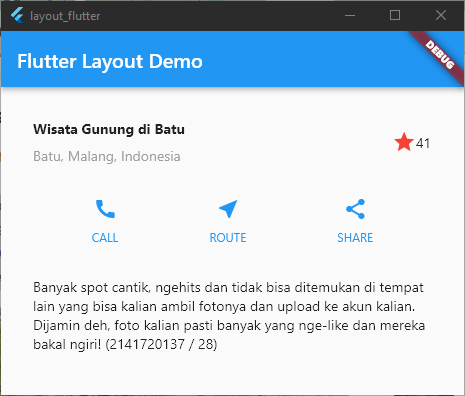
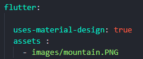
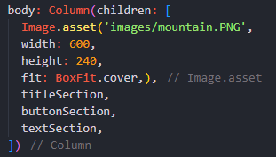
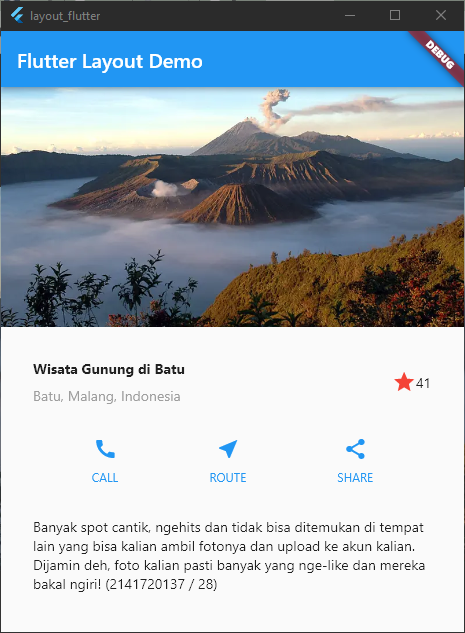

# **28. Salma Annissa Azizi (2141720137) / TI - 3F**

## **<b>PRAKTIKUM 1 : Membangun Layout di Flutter</b>**

**Langkah 1** : Membuat project baru dengan nama layout_flutter  
**Langkah 2** : Mengisi nama dan nim pada text title  
**Langkah 3** : Mengidentifikasi layout diagram  
**Langkah 4** : Mengimplementasikan title row  
- Soal 1  
    **Kode Program** :     
    **Penjelasan** : Meletakkan keyword *Expanded* dimaksudkan agar ukuran widget menyesuaikan ruang yang ada pada halaman. Sedangkan keyword *CrossAxisAlignment.start* bermaksud untuk membuat widget berada pada awal baris.
- Soal 2  
    **Kode Program** :     
    **Penjelasan** : Dilakukan set padding menjadi 8 sehingga antara baris satu dan dua memiliki jarak sebesar 8 piksel. Begitu pula warna text kedua diganti menjadi abu-abu.
- Soal 3  
    **Kode Program** :     
      
    **Penjelasan** : Menambahkan icon star dengan warna merah dan sebuah text '41' serta melakukan pemanggilan titleSection pada widget build.
- Hasil Kode Program  
  

## **<b>PRAKTIKUM 2 : Mengimplementasikan Button Row</b>**
**Langkah 1** : Membuat method Column _buildButtonColumn  
Program akan membuat sebuah kolom menggunakan sebuah metode bernama _buildButtonColumn yang memiliki tiga parameter bertipe Color, IconData, dam String. Di dalam method akan dilakukan penyesuaian ukuran kolom, alignment, icon, dan text. 
**Langkah 2** : Membuat Widget buttonSection  
Program akan menampilkan ketiga ikon menggunakan sebuah method _buildButtonColumn. Kolom di sepanjang sumbu utama akan mengatur ruang kosong secara merata menggunaka kode program MainAxisAlignment.spaceEvenly.
**Langkah 3** : Menambah button section ke body  
- Penjelasan  
Pada praktikum kedua, hasil kode program akan menampilkan sebuah baris yang berisi tiga button bernama call, route, dan share.
- Hasil Kode Program  
  

## **<b>PRAKTIKUM 3 : Mengimplementasi Text Section</b>** 
**Langkah 1** : Membuat Widget textSection  
Program akan mencetak sebuah text dengan tambahan padding di sepanjang tepi text sejumlah 32.  
**Langkah 2** : Menambahkan Variabel Text Section ke Body  
- Hasil Kode Program  
  

## **<b>PRAKTIKUM 4 : Mengimplementasi Text Section</b>** 
**Langkah 1** : Menyiapkan Aset Gambar  
Melakukan pencarian gambar pada internet dan membuat folder images di root project layout_flutter. Setelah itu gambar yang sudah diunduh dimasukkan ke dalam folder images dan melakukan setting pada pubspec.yaml agar gambar dapat ditampilkan oleh program.  
  
**Langkah 2** : Menambahkan Gambar ke Body  
  
**Langkah 3** : Mengubah menjadi ListView  
  
- Hasil Kode Program  
  