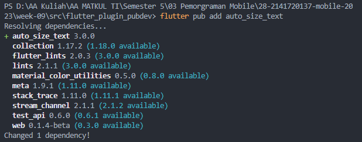

# **P09 - Manajemen Plugin**
## **28. Salma Annissa Azizi (2141720137) / TI-3F**

#### **PRAKTIKUM**
- Menambahkan plugin 
      
- Hasil Praktikum :  
2. Jelaskan maksud dari langkah 2 pada praktikum tersebut!   Jawab : 
    - Langkah 2 bertujuan untuk menambahkan plugin **auto_size_text** pada project yang dibuat.
    - Hal ini dapat dilakukan dengan cara mengetikkan kode program <i> flutter pub add auto_size_text </i> pada terminal dan apabila plugin berhasil ditambahkan maka akan file pubspec.yaml di bagian dependencies akan seperti berikut :     
3. Jelaskan maksud dari langkah 5 pada praktikum tersebut!   Jawab : 
    - Langkah 5 bertujuan untuk menambahkan variabel bernama text yang nantinya akan digunakan sebagai parameter apabila function RedTextWidget dipanggil dan paremeter text bersifat required yang artinya wajib diisikan apabila memanggil function RedTextWidget.  
4. Pada langkah 6 terdapat dua widget yang ditambahkan, jelaskan fungsi dan perbedaannya!  
    Jawab :
    - RedText Widget dipanggil pada Container pertama yang nantinya akan menampilkan hasil text yang lebarnya menyesuaikan dengan maxLines pada plugin. Tampilan yang dimaksud adalah yang berwarna kuning.
    - Container kedua hanya memiliki sebuah child : Text biasa tanpa menggunakan plugin sehingga text tidak dapat menyesuaikan ukuran pada lebar container. Tampilan yang dimaksud adalah yang berwarna hijau.
5. Jelaskan maksud dari tiap parameter yang ada di dalam plugin auto_size_text berdasarkan tautan pada dokumentasi <a href='https://pub.dev/documentation/auto_size_text/latest/'>ini</a> !  
    Jawab : 
    - maxLines
          Digunakan untuk memberikan batas maksimum sebuah baris yang dapat dimuat. Hal ini mencegah text menjadi tampilan yang overload.
    - minFontSize & maxFontSize
          minFontSize memungkinkan font teks akan mengecil menyesuaikan dengan maxLines dan memuat kata semaksimal mungkin dan apabila minimal teks sudah mencapai minimal maka akan dilakukan overflow. Hal tersebut berlaku juga pada maxFontSize.
    - group
          group memungkinkan teks menyesuaikan ukuran font dengan anggota group yang memiliki ukuran font efektif terkecil. 
    - stepGranularity
          stepGranularity memungkinkan merubah ukuran font menjadi lebih kecil agar teks yang dimasukkan muat di batasan. 
    - preseFontSizes
          preseFontSizes memungkinkan pengguna memberikan ukuran font tertentu pada teks yang akan dimuat. Hal ini bertujuan agar ukuran font erubah apabila teks melebihi kapasitas boundaries dan diperkecil menjadi ukuran teks yang sudah diberikan.
    - overflowReplacement
          overflowReplacement memungkinkan pengguna memberikan teks baru ketika teks yang dimasukkan mengalami overflow, sehingga teks tersebut tidak akan ditampilkan dan diganti menjadi isi parameter overflowReplacement.
