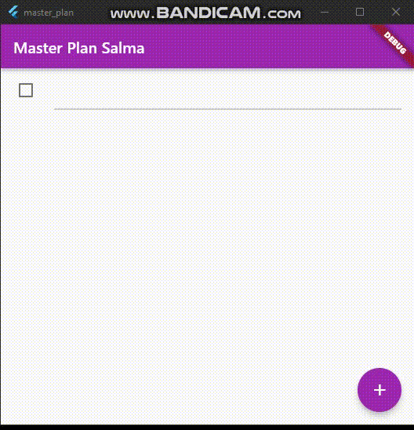
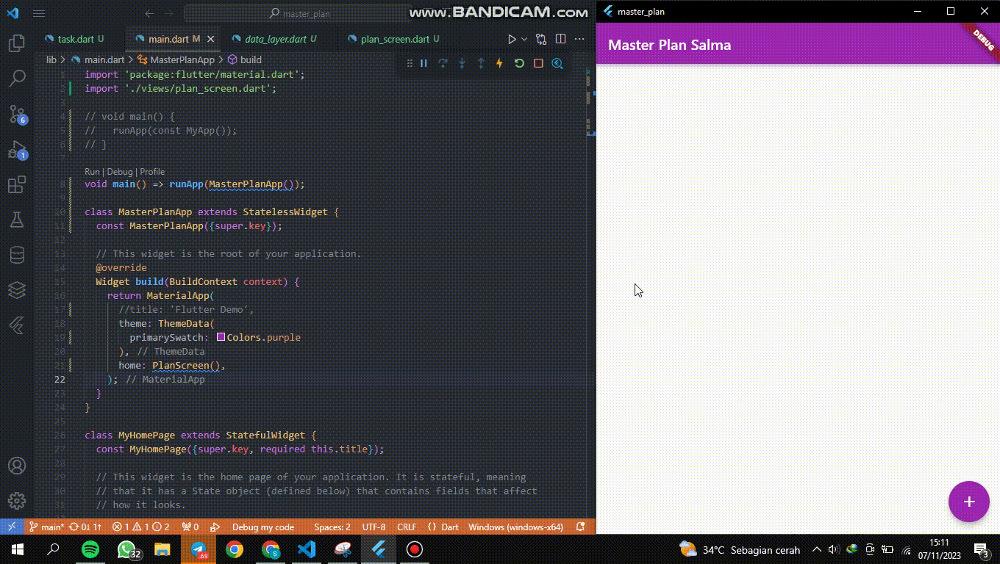
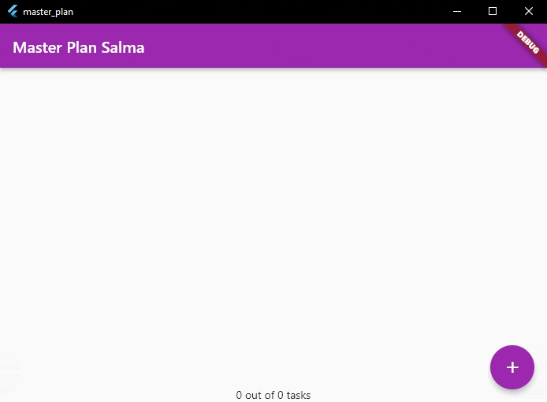
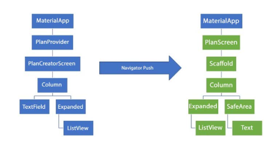
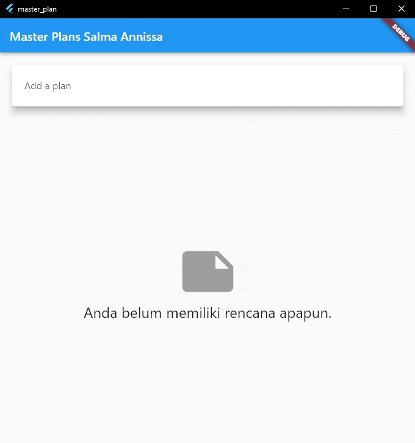

### **28. Salma Annissa Azizi (2141720137) / TI-3F**
## **11. Dasar State Management**

### **Tugas Praktikum 1: Dasar State dengan Model-View**
1. Selesaikan langkah-langkah praktikum tersebut, lalu dokumentasikan berupa GIF hasil akhir praktikum beserta penjelasannya di file README.md!  
Jawab :  
    - Hasil Run  
        
2. Jelaskan maksud dari langkah 4 pada praktikum tersebut! Mengapa dilakukan demikian?  
Jawab :  
    - Hal itu dilakukan supaya pengelolaan dan pengembangan aplikasi lebih mudah dan ringkas dalam mengekspoer kedua model tersebut.
3. Mengapa perlu variabel plan di langkah 6 pada praktikum tersebut? Mengapa dibuat konstanta?  
Jawab :  
    - Variabel plan digunakan untuk mengelola state aplikasi yang mencakup rendana dan daftar tugas yan ditambahkan.
    - Konstanta digunakan sebagai karena plan awal yang tidak berubah dan digunakan sebagai referensi awal yang tidak berubah atau konstan.
4. Lakukan capture hasil dari Langkah 9 berupa GIF, kemudian jelaskan apa yang telah Anda buat!  
Jawab :  
    - Hasil Run  
          
    - Penjelasan : Pada praktikum ini berhasil dibuat sebuah tampilan task list dengan menerapkan sebuah check box.

### **Tugas Praktikum 2: InheritedWidget**
1. Selesaikan langkah-langkah praktikum tersebut, lalu dokumentasikan berupa GIF hasil akhir praktikum beserta penjelasannya di file README.md! Jika Anda menemukan ada yang error atau tidak berjalan dengan baik, silakan diperbaiki sesuai dengan tujuan aplikasi tersebut dibuat.
2. Jelaskan mana yang dimaksud InheritedWidget pada langkah 1 tersebut! Mengapa yang digunakan InheritedNotifier?
    - Jawab :  
        Inherited Widget pada langkah satu menyediakan cara efisien untuk mem-pass dan memantau data melalui pohon widget tanpa perlu melewati parameter ke setiap widget secara manual. Dalam kasus ini Inherited Notifier menyediakan cara yang efisien untuk memantau dan memberi tahu perubahan nilai saat ValueNotifier berubah dan melakukan rebuild.
3. Jelaskan maksud dari method di langkah 3 pada praktikum tersebut! Mengapa dilakukan demikian?
    - Jawab :  
        Maksud dari method di langkah 3 adalah memberikan kode program agar program mencetak nilai berapa tugas yang harus dilakukan dan jumlah tugas yang sudah selesai dilakukan berdasarkan checkbox.
4. Lakukan capture hasil dari Langkah 9 berupa GIF, kemudian jelaskan apa yang telah Anda buat!  
    - Hasil Run :  
        
    - Penjelasan : Pada praktikum ini berhasil dibuat sebuah tampilan task list dengan perhitungan berapa banyak tugas yang harus dilakukan dan berpa banyak tugas yang sudah selesai dilakukan.

### **Tugas Praktikum 3: State di Multiple Screens**
1. Selesaikan langkah-langkah praktikum tersebut, lalu dokumentasikan berupa GIF hasil akhir praktikum beserta penjelasannya di file README.md! Jika Anda menemukan ada yang error atau tidak berjalan dengan baik, silakan diperbaiki sesuai dengan tujuan aplikasi tersebut dibuat.
2. Berdasarkan Praktikum 3 yang telah Anda lakukan, jelaskan maksud dari gambar diagram berikut ini!  \
    
    - Jawab : Sebelum dilakukan perubahan kode program. Hanya ada satu layar yang dapat ditampilkan oleh aplikasi. Dengan sebuah PlanProvider yang mengakses PlanCreatorScreen. PlanCreatorScreen sendiri memiliki sebuah kolom dan textField yang nantinya akan menampilkan ListView. Sedangkan pada praktikum ketiga ditambahkan sebuah layar baru yang akan mengelompokkan tugas berdasarkan jenisnya. Jadi satu jenis tugas nantinya akan tampil di dalam PlanScreen dan untuk detail tugas akan tampil setelah PlanScreen tersebut diklik.
3. Lakukan capture hasil dari Langkah 14 berupa GIF, kemudian jelaskan apa yang telah Anda buat!
    - Hasil Run :  
        
    - Penjelasan : Pada praktikum ini berhasil dibuat sebuah tampilan task list dengan perhitungan berapa banyak tugas yang harus dilakukan dan berpa banyak tugas yang sudah selesai dilakukan.