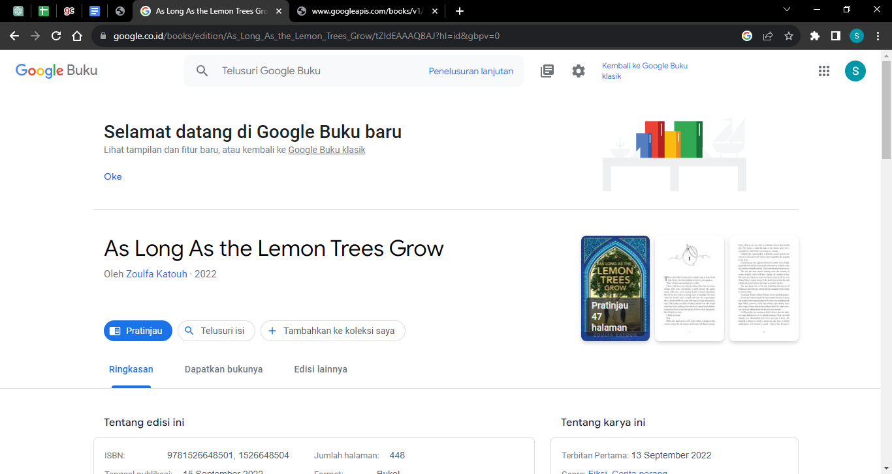
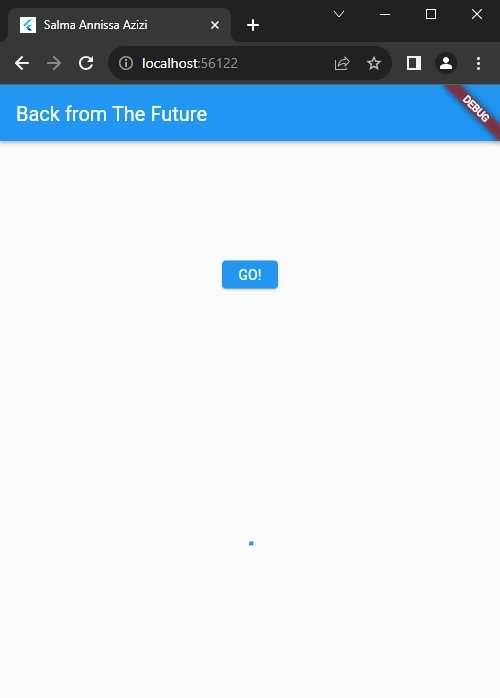
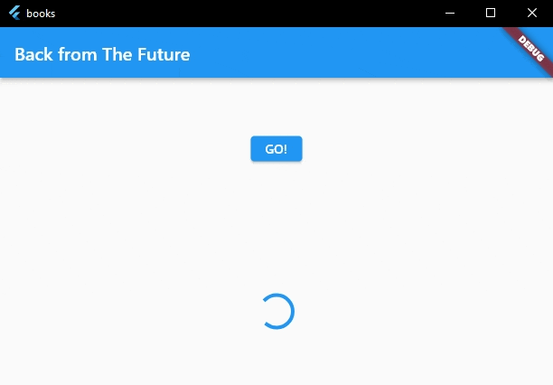
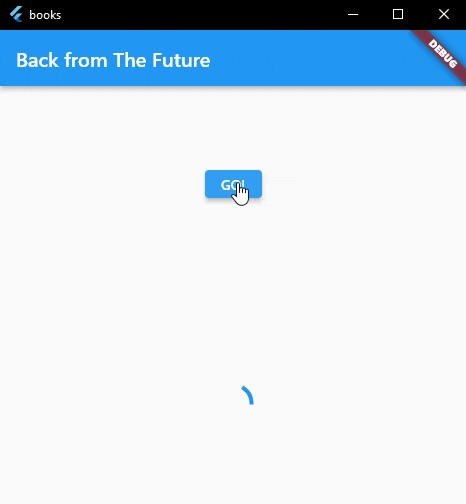

# **P12 Pemrograman Asynchronous**
## **28. Salma Annissa Azizi**

1. Tambahkan nama panggilan Anda pada title app sebagai identitas hasil pekerjaan Anda.  
    **Jawab :**   
2. Carilah judul buku favorit Anda di Google Books, lalu ganti ID buku pada variabel path di kode tersebut. Caranya ambil di URL browser Anda seperti gambar berikut ini. Kemudian cobalah akses di browser URI tersebut dengan lengkap seperti ini. Jika menampilkan data JSON, maka Anda telah berhasil. Lakukan capture milik Anda dan tulis di README pada laporan praktikum. Lalu lakukan commit dengan pesan "W12: Soal 2".  
    **Jawab :**
    - Buku yang digunakan :
        
    - JSON :
        
3. Jelaskan maksud kode langkah 5 tersebut terkait substring dan catchError! Capture hasil praktikum Anda berupa GIF dan lampirkan di README. Lalu lakukan commit dengan pesan "W12: Soal 3".  
    **Jawab**:
    - Substring adalah sebuah method yang digunakan untuk mengambil sebuah data string dengan length tertentu. Pada method substring dimasukkan parameter 0 dan 450 yang artinya kode program akan mengeluarkan output karakter data string dari indeks 0 hingga 449 yang berjumlah 450 karakter.
    - catchError adalah metode penangkapan error yang akan menangani masalah selama pengambilan data. catchError akan mengembalikan data tertentu apabila kode program menangkap masalah. Dengan menggunakan catchError maka kesalahan akan lebih teratasi.
    - Hasil Praktikum :     

4. Jelaskan maksud kode langkah 1 dan 2 tersebut! Capture hasil praktikum Anda berupa GIF dan lampirkan di README. Lalu lakukan commit dengan pesan "W12: Soal 4".  
    **Jawab**: 
    - Penjelasan Langkah 1 : Membuat tiga buah method yang akan mencetak angka 1, 2, 3 dengan waktu delay 3 detik pada setiap method.
    - Penjelasan Langkah 2 : Mendeklarasikan sebuah variabel total bertipe int yang diinisialisasi enol. Ketiga method yang dibuat pada langkah 1 dipanggil pada method count() dan memberikan nilai pada variabel total. Lalu nilai total tersebut akan dicetak menjadi String dan akan tampil setelah program dijalankan selama 9 detik.
    - Hasil Praktikum :     

5. Jelaskan maksud kode langkah 2 tersebut! Capture hasil praktikum Anda berupa GIF dan lampirkan di README. Lalu lakukan commit dengan pesan "W12: Soal 5".  
    **Jawab** :  
    - Deklarasi pada kode program baris pertama berarti bahwa variabel completer yang bertipe late Completer akan diinisialisasi nanti sebelum digunakan. Hal ini memungkinkan pengguna menunggu hasil dari suatu operasi asinkronus. 
    - Function calculate merupakan Future asinkron yang akan menunda eksekusi selama 5 detik menggunakan future.delayed
    - Setelah penundaan selesai makan akan muncul angka 42 pada tampilan karena function getNumber() memanggil calculate.
    - Hasil :     

6. Jelaskan maksud perbedaan kode langkah 2 dengan langkah 5-6 tersebut! Capture hasil praktikum Anda berupa GIF dan lampirkan di README. Lalu lakukan commit dengan pesan "W12: Soal 6".  
    **Jawab** :  
    - Perbedaan pada kedua kode program terletak pada try and catch nya. Pada kode program kedua ini ditambahkan aksi untuk menangani error dan mengembalikan sebuah hasil 'An error occurred' apabila program mengalami error.
    - Hasil dari kode program masih sama dengan sebelumnya karena dalam kode program tidak ditemukan error :     