# **P12 Pemrograman Asynchronous**
## **28. Salma Annissa Azizi**

1. Tambahkan nama panggilan Anda pada title app sebagai identitas hasil pekerjaan Anda.  
    **Jawab :**   
2. Carilah judul buku favorit Anda di Google Books, lalu ganti ID buku pada variabel path di kode tersebut. Caranya ambil di URL browser Anda seperti gambar berikut ini. Kemudian cobalah akses di browser URI tersebut dengan lengkap seperti ini. Jika menampilkan data JSON, maka Anda telah berhasil. Lakukan capture milik Anda dan tulis di README pada laporan praktikum. Lalu lakukan commit dengan pesan "W12: Soal 2".  
    **Jawab :**
    - Buku yang digunakan :
        
    - JSON :
        
3. Jelaskan maksud kode langkah 5 tersebut terkait substring dan catchError! Capture hasil praktikum Anda berupa GIF dan lampirkan di README. Lalu lakukan commit dengan pesan "W12: Soal 3".  
    **Jawab**:
    - Substring adalah sebuah method yang digunakan untuk mengambil sebuah data string dengan length tertentu. Pada method substring dimasukkan parameter 0 dan 450 yang artinya kode program akan mengeluarkan output karakter data string dari indeks 0 hingga 449 yang berjumlah 450 karakter.
    - catchError adalah metode penangkapan error yang akan menangani masalah selama pengambilan data. catchError akan mengembalikan data tertentu apabila kode program menangkap masalah. Dengan menggunakan catchError maka kesalahan akan lebih teratasi.
    - Hasil Praktikum :     

4. Jelaskan maksud kode langkah 1 dan 2 tersebut! Capture hasil praktikum Anda berupa GIF dan lampirkan di README. Lalu lakukan commit dengan pesan "W12: Soal 4".  
    **Jawab**: 
    - Penjelasan Langkah 1 : Membuat tiga buah method yang akan mencetak angka 1, 2, 3 dengan waktu delay 3 detik pada setiap method.
    - Penjelasan Langkah 2 : Mendeklarasikan sebuah variabel total bertipe int yang diinisialisasi enol. Ketiga method yang dibuat pada langkah 1 dipanggil pada method count() dan memberikan nilai pada variabel total. Lalu nilai total tersebut akan dicetak menjadi String dan akan tampil setelah program dijalankan selama 9 detik.
    - Hasil Praktikum :     

5. Jelaskan maksud kode langkah 2 tersebut! Capture hasil praktikum Anda berupa GIF dan lampirkan di README. Lalu lakukan commit dengan pesan "W12: Soal 5".  
    **Jawab** :  
    - Deklarasi pada kode program baris pertama berarti bahwa variabel completer yang bertipe late Completer akan diinisialisasi nanti sebelum digunakan. Hal ini memungkinkan pengguna menunggu hasil dari suatu operasi asinkronus. 
    - Function calculate merupakan Future asinkron yang akan menunda eksekusi selama 5 detik menggunakan future.delayed
    - Setelah penundaan selesai makan akan muncul angka 42 pada tampilan karena function getNumber() memanggil calculate.
    - Hasil :     

6. Jelaskan maksud perbedaan kode langkah 2 dengan langkah 5-6 tersebut! Capture hasil praktikum Anda berupa GIF dan lampirkan di README. Lalu lakukan commit dengan pesan "W12: Soal 6".  
    **Jawab** :  
    - Perbedaan pada kedua kode program terletak pada try and catch nya. Pada kode program kedua ini ditambahkan aksi untuk menangani error dan mengembalikan sebuah hasil 'An error occurred' apabila program mengalami error.
    - Hasil dari kode program masih sama dengan sebelumnya karena dalam kode program tidak ditemukan error :   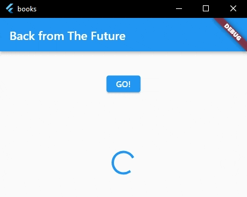  

7. Capture hasil praktikum Anda berupa GIF dan lampirkan di README. Lalu lakukan commit dengan pesan "W12: Soal 7".  
    **Jawab** :  
    - Hasil :   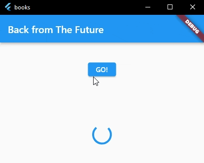  

8. Jelaskan maksud perbedaan kode langkah 1 dan 4!  
    **Jawab** :   
    - Pada langkah satu sampai empat dilakukan pemanggilan future yang bekerja secara paralel. Artinya bahwa dalam satu waktu sebuah program akan mengeksekusi beberapa future sekaligus yang dapat mengurangi waktu yang diperlukan untuk eksekusi supaya lebih efisien. Sebuah class FutureGroup mampu menampung banyak future dan mengeksekusinya disaat yang bersamaan. Selain itu Future.wait juga dapat dimanfaatkan untuk melakukan eksekusi future dalam satu waktu yang sama.  
    - Perbedaan yang signifikan terjadi pada saat menampilkan hasil. Pemanggilan ketiga function yang digunakan pada praktikum kedua mulanya membutuhkan waktu 9s untuk tampil. Namun, saat ketiga function dimasukkan ke dalam FutureGroup waktu yang diperlukan untuk menampilkan hasil hanya 3s.  

9. Capture hasil praktikum Anda berupa GIF dan lampirkan di README. Lalu lakukan commit dengan pesan "W12: Soal 9".  
    **Jawab** :  
    - Hasil Run Code :   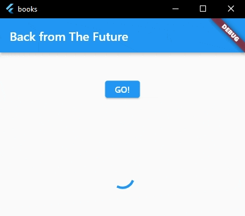  
    - Debug Console :   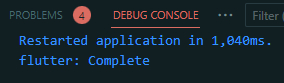  

10. Panggil method handleError() tersebut di ElevatedButton, lalu run. Apa hasilnya? Jelaskan perbedaan kode langkah 1 dan 4!  
    **Jawab** :  
    - Hasil yang ditampilkan sama dengan soal nomor 9.
    - Yang membedakan kedua kode program tersebut adalah penanganan error di langkah pertama dilakukan pada sintaks ElevatedButton. Sedangkan penanganan error pada langkah keempat dilakukan pada function handleError itu sendiri dan ElevatedButton hanya bertugas mengeksekusi program saat tombolnya diklik.

11. Tambahkan nama panggilan Anda pada tiap properti title sebagai identitas pekerjaan Anda.  
    **Jawab** :  
    - Identitas sudah ditambahkan pada title project :   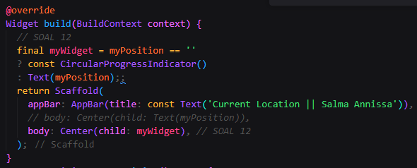

12. **SOAL NO. 12**  
    - Jika Anda tidak melihat animasi loading tampil, kemungkinan itu berjalan sangat cepat. Tambahkan delay pada method getPosition() dengan kode await *Future.delayed(const Duration(seconds: 3));*  
        **Jawab** :   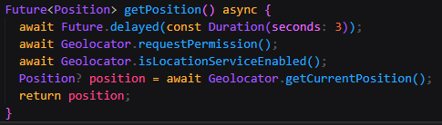  
    - Apakah Anda mendapatkan koordinat GPS ketika run di browser? Mengapa demikian?  
        **Jawab** : Ya. Karena project flutter mengimport package geolocator yang dapat digunakan untuk mengetahui lokasi terkini.  
    - Capture hasil praktikum Anda berupa GIF dan lampirkan di README. Lalu lakukan commit dengan pesan "**W12: Soal 12**".  
        **Jawab** :   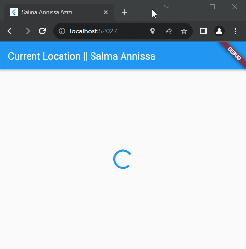

13. Apakah ada perbedaan UI dengan praktikum sebelumnya? Mengapa demikian? Capture hasil praktikum Anda berupa GIF dan lampirkan di README. Lalu lakukan commit dengan pesan "W12: Soal 13".  
    **Jawab** :   
    - Dalam hal ini tidak ada yang berbeda dalam tampilan UI. Hanya saja dalam penjelasan disebutkan bahwa penggunaan FutureBuilder lebih efisien, clean, dan reactive dikarenakan FutureBuilder memiliki status future sendiri, sehingga dapat mengabaikan penggunaan setState.
    - Hasil :   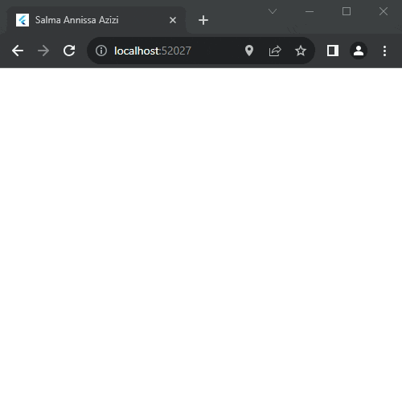  

14. Apakah ada perbedaan UI dengan langkah sebelumnya? Mengapa demikian? Capture hasil praktikum Anda berupa GIF dan lampirkan di README. Lalu lakukan commit dengan pesan "W12: Soal 14".  
    **Jawab** :  
    - Tidak ada perbedaan UI dengan langkah sebelumnya dikarenakan kode program tersebut hanya muncul ketika program menangani error, sedangkan pada program yang saat ini dijalankan tidak ada error yang harus ditangani.
    - Hasil :     

15. Tambahkan nama panggilan Anda pada tiap properti title sebagai identitas pekerjaan Anda. Silakan ganti dengan warna tema favorit Anda.  
    **Jawab** :  
    - Memodifikasi Warna Tema :   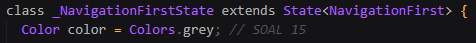  
    - Memodifikasi Properti Title :   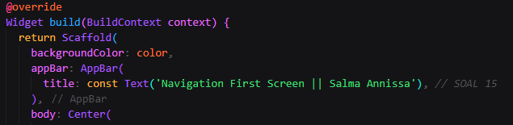  
 
16. **SOAL 16**  
    - Cobalah klik setiap button, apa yang terjadi? Mengapa demikian?  
        **Jawab** : Saat button diklik maka akan terjadi perubahan warna tema. Hal ini disebabkan oleh adanya perubahan variabel warna pada saat button diklik yang merupakan proses dari widget elevated button.
    - Gantilah 3 warna pada langkah 5 dengan warna favorit Anda!  
        **Jawab** :   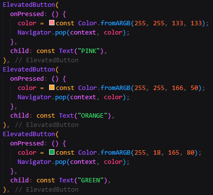  
    - Capture hasil praktikum Anda berupa GIF dan lampirkan di README. Lalu lakukan commit dengan pesan "W12: Soal 16".  
        **Jawab** :   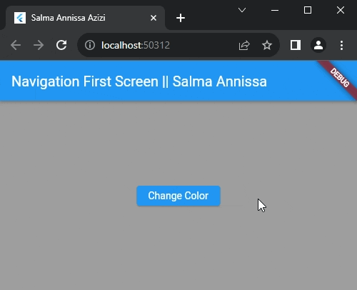  

17. **SOAL 17**  
    - Cobalah klik setiap button, apa yang terjadi? Mengapa demikian?  
        **Jawab** : Warna background berubah seperti pada praktikum sebelumnya. Namun pada praktikum ini diberikan navigasi ke screen baru sehingga warna akan berubah setelah screen baru itu muncul.
    - Gantilah 3 warna pada langkah 3 dengan warna favorit Anda!  
        **Jawab** :   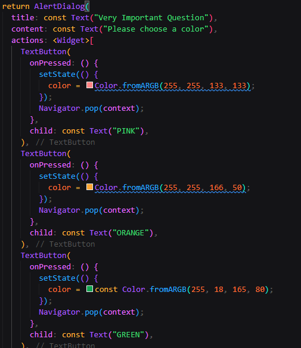  
    - Capture hasil praktikum Anda berupa GIF dan lampirkan di README. Lalu lakukan commit dengan pesan "W12: Soal 17".  
        **Jawab** :   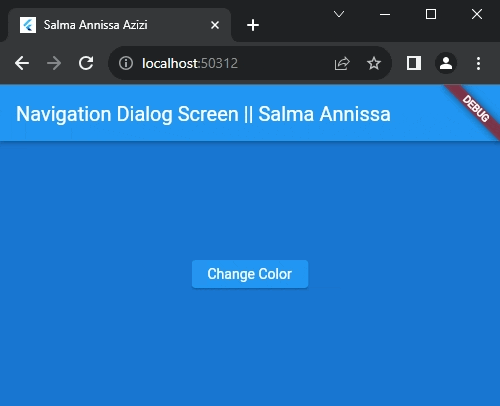
