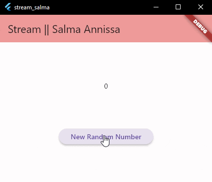

### **28. Salma Annissa Azizi**
# **P13 State Management dengan Streams**

#### **SOAL 1**
- Menambahkan nama pada title untuk identitas dan merubah warna tema yang sesuai   

#### **SOAL 2**
- Menambahkan lima warna lainnya sesuai keinginan pada file stream.dart dalam variabel colors   

#### **SOAL 3**
- Jelaskan fungsi keyword yield* pada kode tersebut!   **Jawab** : Fungsi keyword *yield adalah untuk mengembalikan nilai dari suatu Stream yang dihasilkan oleh fungsi tersebut. Dalam konteks fungsi async, *yield memungkinakn melakukan pengiriman nilai dari suatu Stream secara sekuensial dan memberikan kemampuan untuk membuat dan mengelola data asinkron secara mudah.
- Apa maksud isi perintah kode tersebut?   **Jawab** : Isi perintah dari kode program tersebut adalah untuk mengirimkan elemen-elemen ke dalam `Stream<Color>` secara periodik. `Stream<Color> getColors() async*` adalah deklarasi fungsi bernama getColors yang mengembalikan suatu `Stream<Color>`. Pernyataan `yield*` digunakan untuk mengirimkan elemen-elemen dari suatu stream ke stream lain. Di sini, kita menggunakan `Stream.periodic` untuk membuat stream yang menghasilkan elemen secara periodik berdasarkan durasi yang ditentukan. `const Duration(seconds: 1)` adalah durasi antara setiap elemen yang dihasilkan oleh stream, dalam hal ini, 1 detik. `(int t) {...}` adalah fungsi anonim yang mengambil parameter t (waktu) dan mengembalikan elemen dari stream. Dalam kasus ini, elemen stream adalah warna dari daftar warna `(colors)` yang dipilih berdasarkan indeks waktu (t). 

#### **SOAL 4**
- Hasil run program : Warna background dapat berubah setiap detik  

#### **SOAL 5**
- Jelaskan perbedaan menggunakan listen dan await for (langkah 9) !   **Jawab** : Listen digunakan untuk menampilkan data ketika event yang berjalan sudah selesai dilakukan. Jika data stream yang ditangani tidak perlu keluar secara berurutan dan tidak butuh waktu tunggu maka dapat menggunakan Listen. Sebaliknya jika data yang muncul diperlukan berurutan maka dapat menggunakan await for.

#### **SOAL 6**
- Jelaskan maksud kode langkah 8 dan 10 tersebut!   
    **Jawab** : 
    - **LANGKAH 8**
        - Pada langkah 8 diinisialisasi sebuah variabel numberStream yang nantinya akan memanggil function dari `NumberStream()` dilanjut dengan inisialisasi variabel `numberStreamController` yang diisi dengan controller, berfungsi untuk mengendalikan aliran data pada suatu stream. 
        - Pembuatan variabel stream dengan tipe data Stream akan berisi stream dari variabel `numberStreamController`. Ini dilakukan untuk mendapatkan objek stream dari controller
        - `stream.listen((event) { ... });` digunakan untuk memperbarui state dan mengatur nilai `lastNumer` sesuai dengan event yang diterima.
    - **LANGKAH 10**
        - Pembuatan sebuah function bernama addRandomNumber yang berfungsi untuk menginputkan  (sink) secara random pada stream.
- Hasil :   

#### **SOAL 7**
- Jelaskan maksud kode langkah 13 sampai 15 tersebut!  
    **Jawab** : Maksud dari kode langkah 13 sampai dengan 15 adalah sebuah penanganan error pada program. Apabila program mengalami error maka akan memunculkan nilai -1 yang sudah diinisialisasikan pada variabel lastNumber.
- Hasil :   

#### **SOAL 8**
- Jelaskan maksud kode langkah 1-3 tersebut!  
    **Jawab** :
    - Pada langkah 1 membuat variabel transform bertipe late StreamTransformer
    - Pada langkah 2 dilakukan inisialisasi variabel stream dengan menerapkan `sink`. `handleData` digunakan untuk menambahkan data dalam stream dengan `value * 10`. Sedangkan `handleError` bertugas untuk menangani error dan akan mengembalikan value `-1` apabila terjadi error. `handleDone` digunakan untuk menutup sink ketika sink selesai.
    - Pada langkah 3 dilakukan pemanggilan variabel transform yang telah diinisialisasi pada `stream.listen((event){})`.
- Capture hasil praktikum Anda berupa GIF dan lampirkan di README.   

#### **SOAL 9**
- Jelaskan maksud kode langkah 2, 6 dan 8 tersebut!  
    **Jawab**:
    - **LANGKAH 2**  
        - Menambahkan subscription menggunakan `stream.listen((event){ })` dan melakukan inisialisasi variabel lastNumber yang akan menyimpan nilai dari event.
    - **LANGKAH 6**  
        - `subscription.cancel()` digunakan untuk membatalkan langganan dari sebuah stream. Artinya jika `stream` melakukan perubahan maka program tidak akan lagi mengetahui perubahan di dalam stream karena sudah dilakukan pembatalan pada subscription.
    - **LANGKAH 8**  
        - Modifikasi method ini bertujuan untuk menambahkan penanganan saat subscription dibatalkan maupun pada saat subscription sedang berlangsung.
        - Pada saat subscription masih berlangsung maka program akan melakukan sink pada stream dan mencetak angka random. Namun, pada saat subscription dibatalkan program akan mencetak nilai `-1` dan menghasilkan debug sebagai berikut :   
- Capture hasil praktikum Anda berupa GIF dan lampirkan di README.   

#### **SOAL 10**
- Jelaskan mengapa error itu bisa terjadi?   
    **Jawab**: Hal ini karena stream sudah dilakukan subscription sebelumnya. Pada umumnya satu stream hanya dapat dilakukan satu subscription, sedangkan pada penambahan kode program praktikum ini bermaksud untuk melakukan subscription yang kedua kalinya. Maka dari itu error bisa terjadi   

#### **SOAL 11**
- Jelaskan mengapa hal itu bisa terjadi?  
    **Jawab**: Stream dapat dilakukan subscription sebanyak dua kali karena adanya set broadcast yang telah dilakukan di langkah 4. Pada dasarnya broadcast memang dapat dimanfaatkan untuk multiple subscription.
- Capture hasil praktikum Anda berupa GIF dan lampirkan di README.   

#### **SOAL 12**
- Jelaskan maksud kode pada langkah 3 dan 7!  
    **Jawab**:  
    - **LANGKAH 3**  
        - Pada langkah ini class NumberStream akan melakukan stream dengan value sebuah angka random mulai dari 0 sampai dengan 9 dan akan berganti setiap hitungan satu detik.
    - **LANGKAH 7**  
        - Hal ini dimaksudkan untuk penanganan error. Jika pada kode program terdapat error maka program akan mencetak 'Error'. Sedangkan jika kode program tidak error dan snapshot memiliki data maka program akan mencetak angka random yang sudah diinisialisasikan pada langkah 3 dengan ukuran font 96. 
- Capture hasil praktikum Anda berupa GIF dan lampirkan di README.   

#### **SOAL 13**
- Jelaskan maksud praktikum ini! Dimanakah letak konsep pola BLoC-nya?  
    **Jawab**:  
    - Letak Konsep Pola BLoC :   
    - Maksud dari praktikum ini ialah untuk menangani sebuah streamEvent, BLoC dapat digunakan untuk melapisi semua sumber data dan UI yang menggunakan data tersebut. Pada praktikum ini digunakan dua buah controller yang menangani dua kasus yaitu input dan output. `_generateRandomController` digunakan sebagai sink yang dapat memasukkan angka pada sebuah stream. Sedangkan `_randomNumberController` digunakan sebagai stream yang menangani keluaran dari sink.
- Capture hasil praktikum Anda berupa GIF dan lampirkan di README.   